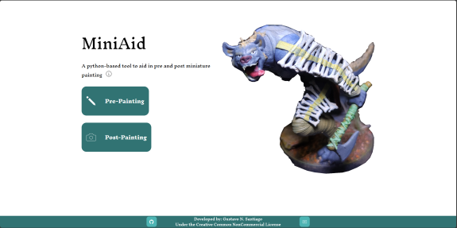
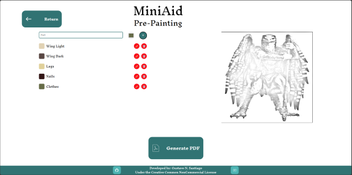
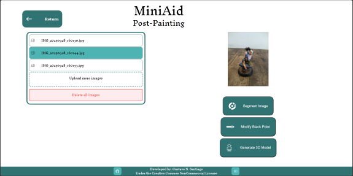
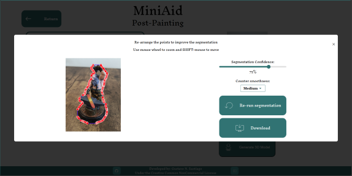
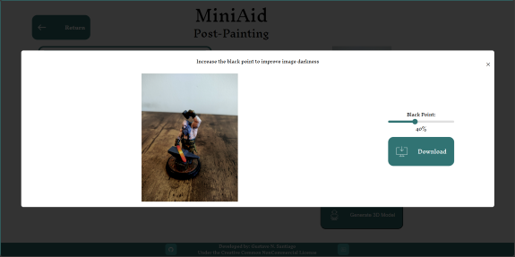
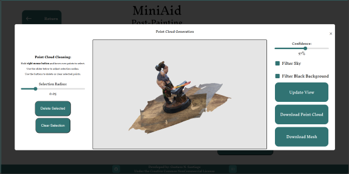

**<center>MiniAid</center>**
A standalone tool to aid in the process of painting and publicize miniatures


**<center>Summary</center>**
- [Purpose](#purpose)
- [Frameworks Used](#frameworks-used)
- [How to Collaborate](#how-to-collaborate)
- [How to Set Up](#how-to-set-up)
  - [Prerequisites](#prerequisites)
  - [Installation](#installation)
- [How to Use](#how-to-use)
  - [Pre-Painting](#pre-painting)
  - [Post-Painting](#post-painting)

# Purpose
MiniAid is a Python-based tool designed to assist users in both pre-painting and post-painting processes for miniature models. It provides functionalities such as image cropping, sketch generation, segmentation, point cloud reconstruction, and mesh generation. The tool aims to streamline workflows for artists and hobbyists working with miniature painting and 3D modeling.



# Frameworks Used
MiniAid leverages the following frameworks and libraries:

* Flask: For building the web application and serving static files.
* OpenCV: For image processing and manipulation.
* Open3D: For point cloud visualization and manipulation.
* Ultralytics Yolov11: For segmentation tasks.
* VGG-T: For 3D reconstruction and alignment.
* ReportLab: For generating PDFs with color palettes.
* Pillow (PIL): For image handling and manipulation.

# How to Collaborate

To contribute to MiniAid:

1. Fork the repository on GitHub.
2. Clone your forked repository:

```
git clone https://github.com/GustavoSantiago113/MiniAid.git
```

3. Create a new branch for your feature or bug fix:

```
git checkout -b feature-name
```

4. Make your changes and commit them:

```
git commit -m "Add feature-name"
```

5. Push your changes to your forked repository:

```
git push origin feature-name
```

6. Submit a pull request to the main repository.

# How to Set Up

Follow these steps to set up MiniAid locally:

## Prerequisites

* Python 3.8 or higher
* Pip (Python package manager)
* Git

## Installation

1. Clone the repository:

```
git clone https://github.com/GustavoSantiago113/MiniAid.git
cd MiniAid
```

2. Create a virtual environment:

```
python -m venv venv
source venv/bin/activate  # On Windows: venv\Scripts\activate
```

3. Install dependencies:

```
pip install -r requirements.txt
```

4. Run the Flask application:

```
cd app
python app.py
```

5. Or run using the "start_miniAid.bat" file. Just remember to change the path from it to your actual path.

# How to Use

## Pre-Painting
1. Navigate to the **Pre-Painting** page.
2. Upload an image to crop and generate a sketch.
3. Adjust the crop area and save the cropped image.
4. Write the part and select the respective color.
5. Generate a PDF with color palettes based on the cropped image.



## Post-Painting
1. Navigate to the Post-Painting page.



2. Upload multiple images of your miniature model.
3. Perform segmentation to isolate specific areas of the images.



4. Change the Black Point of the images to make it look darker and cooler.



5. Download the segmented image to share in your social media.
6. Generate a point cloud from the uploaded images.



7. (Optional) Increase the confidence from the model to refine it, or use your mouse as brush to remove undesired points.
8. Download the point cloud for further use.
9. Or you can download the Mesh to show it later.

